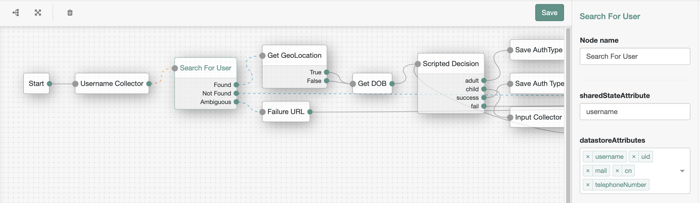

<!--
 * The contents of this file are subject to the terms of the Common Development and
 * Distribution License (the License). You may not use this file except in compliance with the
 * License.
 *
 * You can obtain a copy of the License at legal/CDDLv1.0.txt. See the License for the
 * specific language governing permission and limitations under the License.
 *
 * When distributing Covered Software, include this CDDL Header Notice in each file and include
 * the License file at legal/CDDLv1.0.txt. If applicable, add the following below the CDDL
 * Header, with the fields enclosed by brackets [] replaced by your own identifying
 * information: "Portions copyright [year] [name of copyright owner]".
 *
 * Copyright 2017 ForgeRock AS.
-->
# Search For User Authentication Tree Node

A simple authentication node for ForgeRock's Identity Platform 5.5 and above. This node searches for a user based on a set of configurable user search profile attributes. 

## Installation

Copy the .jar file from the ../target directory into the ../web-container/webapps/openam/WEB-INF/lib directory where AM is deployed.  Restart the web container to pick up the new node.  The node will then appear in the authentication trees components palette.
## Usage

Deploy the node and set the configuration as appropriate. Set 'sharedStateAttribute' to the name of the shared state attribute which holds the value to search for (default: username). Set 'datastoreAttributes' to the set of user profile attributes to search. For example, to allow a user to login using either username, email adress, or their full name, add "uid", "mail", and "cn".

Wire the outcomes as appropriate. Where a search results in multiple matching user profiles, the outcome "ambiguous" is generated. 

## To Build

The code in this repository has binary dependencies that live in the ForgeRock maven repository. Maven can be configured to authenticate to this repository by following the following [ForgeRock Knowledge Base Article](https://backstage.forgerock.com/knowledge/kb/article/a74096897).

Edit the necessary SearchForUserNode.java as appropriate.  To rebuild, run "mvn clean install" in the directory containing the pom.xml  

## Disclaimer
The sample code described herein is provided on an "as is" basis, without warranty of any kind, to the fullest extent permitted by law. ForgeRock does not warrant or guarantee the individual success developers may have in implementing the sample code on their development platforms or in production configurations.

ForgeRock does not warrant, guarantee or make any representations regarding the use, results of use, accuracy, timeliness or completeness of any data or information relating to the sample code. ForgeRock disclaims all warranties, expressed or implied, and in particular, disclaims all warranties of merchantability, and warranties related to the code, or any service or software related thereto.

ForgeRock shall not be liable for any direct, indirect or consequential damages or costs of any type arising out of any action taken by you or others related to the sample code.

[forgerock_platform]: https://www.forgerock.com/platform/  
